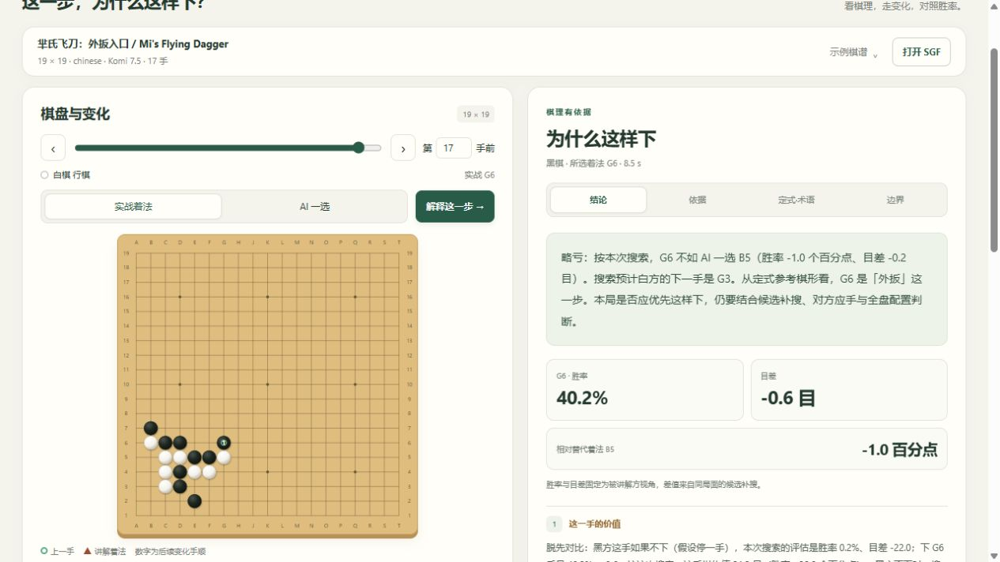
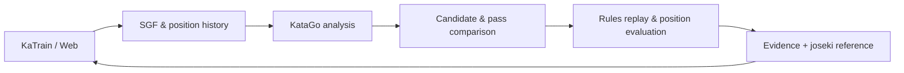

# KataGo Explainer

**看懂这一手，走完这条变化。**

基于 KataGo 的围棋着法解释与复盘插件。在 KaTrain 内比较实战手与 AI 一选，
用可重放的棋盘事实、搜索变化和定式参考回答“为什么这样下”。

**Understand the move. Follow the line.** An evidence-driven Go review plugin
embedded in KaTrain, with an interactive web demo sharing the same core.

[使用 / User guide](docs/USAGE.md) · [架构 / Architecture](docs/ARCHITECTURE.md) ·
[验证 / Validation](docs/EVALUATION.md) · [简历与演示 / Portfolio](docs/PORTFOLIO.md)

**[下载软件 / Download the app](https://k4ju1.github.io/katago-explainer/)** ·
[直接下载安装包 / Download the Windows installer](https://github.com/k4ju1/katago-explainer/releases/download/v0.2.0-beta.2/KataGo-Explainer-Setup-v0.2.0-beta.2-win64.exe)

无需 GitHub 账号、Python 或单独下载模型。 / No GitHub account, Python installation or separate model download is needed.



*辅助网页演示；主入口为原生 KaTrain 插件。 / The web demo is shown here; the primary interface is the native KaTrain plugin.*

## Features / 核心体验

| 功能 / Feature | 实现 / Behavior |
| --- | --- |
| 先给结论 / Verdict first | 比较实战手与原始 AI 一选，显示胜率、目差及近似等价。 / Compare the played move and original first choice, including near-equal evaluations. |
| 逐手讲解 / Replay | 切换两条搜索变化，逐手播放棋盘与固定视角的评估。 / Replay both continuations with fixed-player evaluations. |
| 棋理有依据 / Evidence | 规则核验提子、打吃、连接和气数；区分搜索判断与推测。 / Rule-checked facts are separated from search assessments and tentative interpretations. |
| 定式与棋语 / Joseki & terms | 七项精选参考，包含尖顶、秀策尖、托退、芈氏飞刀外扳入口；附中文棋语、手顺与出处。 / Seven sourced references with Chinese terminology and sequences. |
| 原生集成 / Native | 复用 KaTrain 的引擎，保留棋谱树，安装可恢复。 / Share the host engine, preserve the game tree and support restoration. |

支持中英讲解；原生入口按钮跟随 KaTrain 界面语言。网页支持 SGF 上传、自选候选与经典样例。

Chinese/English explanations share the same evidence. Native buttons follow
KaTrain's language; the web demo supports SGF import, custom candidates and samples.

## Start / 开始使用

1. 打开[下载页面](https://k4ju1.github.io/katago-explainer/)，点击 Windows 下载。
   / Open the download page and select the Windows download.
2. 双击下载的 `.exe`，选择中文或 English，按安装向导完成安装。
   / Open the `.exe`, choose Chinese or English, and follow the installer.
3. 点击桌面上的 **KataGo Explainer** 图标。首次安装完成后可直接打开秀策尖样例，
   等待引擎就绪，点击“解释刚才一手”。
   / Open the desktop icon. The post-install launch opens the Shusaku sample;
   wait for the engine, then select “Explain last move”.

需要 **Windows 10/11 x64** 和支持 **OpenCL** 的显卡驱动；首次引擎调优可能需要几分钟。
当前为未签名的测试版，Windows 可能显示发布者未知。软件安装在当前用户目录，
包含 KaTrain、KataGo、模型及插件。

Requires Windows 10/11 x64 and an OpenCL-capable graphics driver. Initial tuning
may take several minutes. This unsigned beta may appear as an unknown publisher.
The installer includes the host, engine, model and plugin and installs for the current user.

## Source development / 源码开发

需要 Python 3.11+ 进行安装；原生运行使用 KaTrain 自带环境。固定支持
**KaTrain v1.20.0 Windows 文件夹版**，程序与模型自行准备。

Python 3.11+ is needed for installation; native execution uses KaTrain's bundled
environment. The target is the **KaTrain v1.20.0 Windows folder build**.

```powershell
python scripts/launch_katrain.py --katrain-dir 'C:\path\to\KaTrain'
```

本机已配置时可双击 `START_KATRAIN_EXPLAINER.cmd`。打开
`examples/shusaku-demo.sgf`，走到第 3 手黑 D5，点击“解释刚才一手”。

On the configured computer, use the `.cmd` launcher. Open the Shusaku sample,
advance to Black D5 at move three, and select “Explain last move”.

辅助网页：`python -m explainer.server --open-browser`。引擎配置与所有样例见[使用指南](docs/USAGE.md)。

For the optional web demo, run the command above. The guide covers engine paths and samples.

## Design / 设计



核心仅用 Python 标准库；原生视图使用 KaTrain 自带 Kivy；网页采用 HTML、CSS、JavaScript，
无需构建工具。两种入口共用请求协议与解释流程。

The core uses the Python standard library, the native view uses KaTrain's Kivy,
and the web uses plain HTML/CSS/JavaScript without a build step.

## Verify / 验证

```powershell
python -m unittest discover -s tests -v
python scripts/validate_demo.py examples/mi-flying-dagger-demo.sgf --move 17 --repeat 2
```

单元测试无需 GPU；真实验证保存请求、响应和结果到 `runs/`。CI 配置覆盖 Windows/Linux
和 Python 3.11/3.12，实测范围与复现方法见[验证文档](docs/EVALUATION.md)。

Tests require no GPU. Real validation retains logs and results. The CI
configuration covers Windows/Linux and Python 3.11/3.12.

安装器与便携包由[发布工作流](.github/workflows/release.yml)从固定 SHA256 的官方包构建，
附来源记录与文件校验；[打包说明](docs/DISTRIBUTION.md)提供复现方法。

The release workflow verifies the pinned official host and builds the installer
and portable archive with provenance and checksums. See the distribution guide.

讲解由规则和证据模板生成，未接入语言模型。定式目录覆盖有限，搜索变化是参考路线，
有限预算的评估差异不能作为严格因果证明。原生接入依赖固定版本的界面资源。

Explanations use rules and evidence templates. Reference coverage is curated;
search lines are illustrative and finite-search differences are not causal proof.
Native integration is version-pinned.

[定式来源 / Joseki sources](docs/JOSEKI_REFERENCES.md) · [第三方声明 / Notices](THIRD_PARTY_NOTICES.md)
