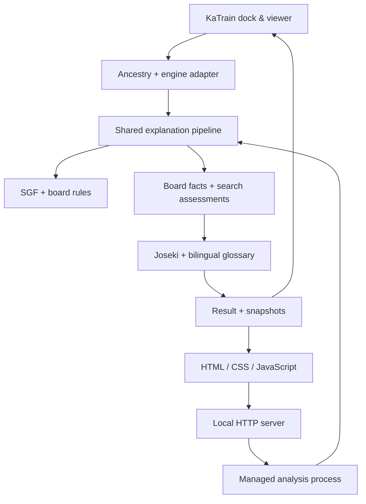

# Architecture / 架构

同一解释核心服务两个入口：KaTrain 插件是主产品，网页是演示与开发入口。
原生复用宿主引擎，独立页面管理自己的可复用引擎进程。

One core serves two interfaces. KaTrain shares its host engine; the web demo
owns a reusable analysis process.

| 模块 / Module | 责任 / Responsibility |
| --- | --- |
| `explainer/board.py`, `sgf.py` | 规则重放、劫、历史与 SGF 导入。 / Rules, ko/history and SGF import. |
| `explainer/engine.py` | 共享请求与响应校验；进程、期限、清理和热复用。 / Protocol contract and process lifetime. |
| `explainer/service.py` | 搜索协调、逐节点评估与结果组织。 / Searches, position evaluations and results. |
| `explainer/explanation.py` | 结论、棋形事实、搜索依据与推测分级。 / Verdicts and graded evidence. |
| `explainer/joseki.py`, `terms.py` | 有来源的手顺前缀、对称匹配、历史核对与双语棋语。 / Sourced references and terminology. |
| `plugins/katrain/` | 宿主适配、原生视图与棋盘皮肤。 / Host adapter, native viewer and skin. |
| `web/`, `explainer/server.py` | 无构建步骤的网页与本机异步接口。 / No-build web demo and local async API. |
| `scripts/` | 安装恢复、素材生成与真实演示验证。 / Installation, assets and real-demo validation. |

## Search / 搜索流程

1. 重放完整历史，确定被讲解方；根搜索 **800 visits**，保留原始 `order=0`。
   / Replay history and retain the original first choice from an 800-visit root search.
2. 同一局面下补搜最多两个候选，各 **600 visits**；只限制首着，后续应手自由。
   / Independently re-search up to two candidates, restricting only their first moves.
3. 适用时进行两个 **300 visits** 假设停一手对比，提供局部价值与紧迫性线索。
   / Two hypothetical-pass searches probe local value and urgency.
4. 根据访问量截断不可信 PV 尾部，每条最多六手；规则核验后，后续节点各搜索 **200 visits**，起点保留根评估。
   / Truncate weak PV tails, replay them legally and evaluate every retained position.
5. 统一执棋方视角，生成双语依据和快照，定式参照单独展示。
   / Normalize perspective and produce bilingual evidence; references remain separate.

请求由共享函数构造，原生适配加入宿主优先级与配置覆盖。一次只运行一个讲解任务，
独立节点批量发送。桥接、进程和安装事务的错误路径有回归测试。

Both adapters use the same request builder. The native adapter adds host priority
and overrides. One explanation runs at a time; independent positions are batched.
Failure paths have regression coverage.

## Evidence / 证据

规则重放核验棋盘事实；候选差异、假设停一手和归属预测标为搜索支持；位置性解释标为推测。
定式匹配支持八种对称变换和黑白交换，真实手顺与仅棋形匹配分别标注。

Rule facts, search-supported assessments and tentative interpretations are
distinct. References support eight symmetries and color reversal, distinguishing
recorded history from equivalent setup shapes.

未重新训练 KataGo，也没有完整定式库或未经核验的语言模型补写。
后续可做专业棋手盲评、更多有来源的分支与更广泛的宿主适配。

The project does not retrain KataGo or claim complete reference coverage.
Next steps include expert blind evaluation, sourced branches and broader host support.
