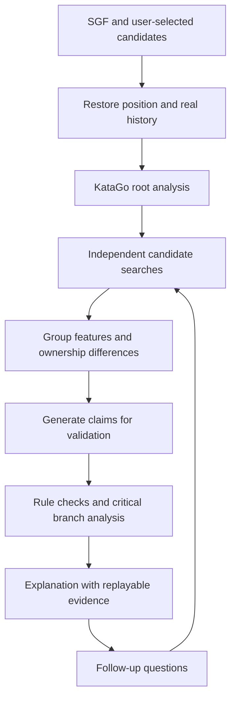

# Project plan: Evidence-grounded Go move explanations with KataGo

Updated: 2026-10-03. This plan is designed for an individual developer learning both Go and software development, with the goal of producing a working application and a reproducible evaluation.

[中文方案](PROJECT_PLAN.zh-CN.md) · [Usage / 使用说明](USAGE.md) · [Bilingual feasibility report](feasibility.md)

The schedule, dataset sizes, search budgets, and acceptance targets below are proposed starting points. They describe planned work, not implemented features or measured explanation quality. The feasibility report records the interface checks that have actually run.

**Current local MVP:** import an SGF main line, replay legal board positions, choose the recorded move, AI recommendation, or a custom move, and read bilingual template explanations grounded in board facts and candidate searches. Candidate PVs can be replayed; their positions are searched independently to display a curve from the explained player's fixed perspective. See [Usage](USAGE.md) to test it. Deep language-model reasoning, comprehensive claim verification, and a controlled explanation evaluation remain planned work; the roadmap below is a plan, not a record of completed validation.

## 1. Project goals

Build a Go review application that combines KataGo candidate analysis, counterfactual search, board facts, and evidence-constrained language generation.

The intended users know the basic rules of Go and want to understand their own games at a beginner or intermediate level. The first version supports this workflow:

> Import an SGF → select a move → compare KataGo's recommendation with the played move → replay candidate variations → read an explanation → specify another move to compare → export a review report.

The central question is: **For the same position, rules, and controlled search budget, how do recommendation A and alternative B differ? Which opponent response exposes the difference, and which board facts support the explanation?**

The evaluation has two goals: reduce unsupported Go claims and improve users' understanding and transfer of the underlying ideas. Whether the system achieves these goals must be tested.

Reuse KataGo's existing engine and models. Focus development on search scheduling, candidate comparison, board features, claim validation, and evidence presentation.

## 2. Define “Why is this the top move?” accurately

### 2.1 Engine ranking and maximum win rate

Identify the top recommendation using `order == 0` in `moveInfos`. Do not sort candidates by `winrate` and label the resulting first move as KataGo's recommendation. Move selection involves search, utility, and selection rules. The documented `playSelectionValue` combines win rate, score, and other properties. A sparsely visited candidate with a temporarily higher win-rate estimate is not necessarily a better recommendation. See the [KataGo v1.18.1 Analysis Engine documentation](https://github.com/lightvector/KataGo/blob/v1.18.1/docs/Analysis_Engine.md).

Separate three user questions:

| Question | What the system should provide |
| --- | --- |
| Why did the AI rank it first? | The original ranking, visits, analysis configuration, and ranking stability |
| Why is it better than my move? | Independent candidate estimates and opponent responses, all from the original player's perspective |
| What Go idea does it express? | Specific claims supported by groups, liberties, legal variations, and prediction differences |

### 2.2 A good move need not increase the displayed win rate

A position estimate already incorporates expectations about good future play. Playing a good move may therefore leave its estimated win rate almost unchanged. Differences between before-move and after-move estimates can also come from search budgets, root aggregation, and estimation noise.

The primary comparison for move quality is **between available moves in the same position**. A game-wide win-rate curve may still be useful, but it must be separate from the estimated loss relative to a reference recommendation.

Win rate can saturate in heavily winning or losing positions. Display both win rate and `scoreLead`; an illustrative comparison might be “0.2 percentage points apart, but an estimated score difference of 3 points.” These are engine estimates under a particular model and configuration, not the user's personal probability of winning a real game.

### 2.3 What an explanation can establish

The output is a post-hoc explanation supported by board facts and search evidence. It does not recover the neural network's complete internal decision process or mathematically prove every possible continuation.

A suitable statement is: “In the current search, A avoids the cutting problem shown in variation V, and the candidate comparison supports A over B.” For complex life-and-death situations, qualify statements with “in this variation” or “the current search predicts.”

## 3. First-version scope and deliverables

### 3.1 Required scope

| Capability | First-version scope | Acceptance check |
| --- | --- | --- |
| SGF import | One SGF, main-line navigation, 9/13/19 boards, preserving rules, komi, handicap, and real history | Check known records move by move |
| Basic analysis | Analyze a selected position; show the top three candidates, win rate, score lead, and visits | Displayed numbers match raw JSON |
| Candidate comparison | Recommendation, played move, and another candidate; accept a legal coordinate from the user | Search candidates independently and record budgets |
| Board presentation | Stones, coordinates, candidates, variation replay, and ownership prediction differences | Explanation references lead to the relevant variation |
| Introductory explanations | Prioritize captures, connections, cutting points, and defense; provide limited explanations elsewhere | Each claim is reviewable |
| Claim validation | Coordinates, player, liberties, captures, variation legality, numbers, and evidence references | Automated checks plus human review |
| Follow-up questions | “Why not here?”, “What if the opponent plays elsewhere?”, “Which group is affected?” | Obtain new evidence through analysis tools |
| Export | Markdown/HTML reports and analysis JSON, including evidence and environment metadata | Reports are readable elsewhere; analysis conditions are reproducible |
| Bilingual experience | Chinese/English documentation, and planned `zh-CN`/`en` switches for UI labels and explanations | Both languages share the same numeric evidence and consistent terminology |

For a position immediately before move t, the played move is the next actual move in the SGF. Clearly label whether the user is viewing a pre-move analysis or a post-move position.

Keep the README bilingual and maintain complete Chinese and English project plans. The local MVP provides bilingual labels and template explanations, alongside the bilingual CLI/report. Further UI and explanation development should keep `zh-CN` and `en` aligned through a shared glossary for terms such as liberties, atari, ownership prediction, score lead, and principal variation.

### 3.2 Later extensions

Defer comprehensive life-and-death reading, complex ko, ladder tutorials, player-strength personalization, whole-game explanations, online-play integration, accounts, and cloud deployment until the core evaluation is complete. A local web application is a sufficient first release. Cached analysis and exported reports should support a demonstration without relying on live external services.

Ladders depend on stones across the full board. Claims such as “two eyes,” “unconditionally dead,” or “guaranteed sente” require independent verification capabilities; a visual label or prompt alone is insufficient.

### 3.3 Release package

1. A runnable local review application with installation and startup instructions.
2. A clearly organized source repository with pinned dependencies and configurations.
3. A small annotated position dataset with split definitions, labels, and review records.
4. Raw engine output, explanation evidence packages, and baseline/ablation results.
5. An evaluation report covering failures, runtime, and limitations.
6. Project documentation, a demonstration deck or walkthrough, and a 3–5-minute demo video.

## 4. Architecture: Begin with a controlled agent workflow

Use explicit tool-call steps. Programs handle Go calculations and factual checks. A language model organizes confirmed evidence into explanations and may propose additional queries within a fixed budget.



Proposed first-version tools:

| Tool | Input | Output | Responsibility |
| --- | --- | --- | --- |
| `analyze_position` | Real history, rules, komi, budget | Raw candidates and position estimates | Identify the current recommendation |
| `compare_moves` | One position and 2–3 candidates | Independent estimates, variations, ownership differences | Identify trade-offs |
| `inspect_groups` | Board and legal move | Groups, liberties, direct connections, captures | Supply exact board facts |
| `analyze_branch` | Legal continuation prefix after a candidate | Alternative responses and estimates at critical nodes | Examine counterplay |
| `validate_claims` | Structured claims and evidence | Supported, contradicted, or insufficient evidence | Control explanation quality |

These are planned interfaces, not a claim that the tools already exist. Implement ordinary Python functions first; introduce an agent framework only when workflow complexity justifies it.

Limit candidate count, search budgets, extra-search rounds, waiting time, and explanation length. A starting policy might allow three candidates, two extra-search rounds, and at most two additional counterplay branches. When the budget is exhausted, return available evidence and unresolved questions.

## 5. Core method: Counterfactual candidate comparison

### 5.1 Reconstruct the same position

Record board size, real move history, initial stones, player to move, rules, komi, engine version, model, and search configuration. Do not reuse an explanation unchanged after its model or rules change.

Handle SGF properties `SZ/KM/RU/AB/AW/PL/HA`, support passes, and explicitly define support for branches and setup nodes inside a record. If a rules label cannot be mapped reliably, ask the user to confirm the analysis conditions and record the chosen rules. Do not silently analyze every game at a default komi of 7.5.

Validate coordinate conversion on a small sample: GTP columns skip I, SGF and display origins require conversion, and ownership arrays are row-major from the upper left. A coordinate error invalidates the explanation pipeline.

### 5.2 Candidate discovery and stability

Start with unrestricted root search. Select A from `order=0`, B from the next-ranked candidate, and C from the played move; remove duplicates. If C was not explored, explicitly search it instead of treating its evaluation as unavailable forever.

Suggested starting budgets are 256/1024 visits for development smoke tests and candidate discovery, 2048 visits for comparisons, and 8192 visits for difficult positions. Calibrate these against measured speed and ranking changes; they are not latency promises.

For important positions, repeat unrestricted root search at a higher budget. If the recommendation changes, update the explanation target and record the change. Present trade-offs that appear after independent candidate searches rather than concealing them.

### 5.3 Give candidates comparable independent budgets

Submit separate requests for A/B/C, retaining the same history and constraining only the first move. For example, to evaluate Q5 with Black to move:

```json
{
  "allowMoves": [
    {"player": "B", "moves": ["Q5"], "untilDepth": 1}
  ]
}
```

`untilDepth=1` constrains the root move; subsequent replies remain unrestricted. Keep `maxVisits` and other settings consistent, and record actual candidate visits and elapsed time. Equal visits control one aspect of the experiment but do not imply identical computational work. See the [official `allowMoves` definition](https://github.com/lightvector/KataGo/blob/v1.18.1/docs/Analysis_Engine.md).

Every singly constrained candidate may become `order=0` in its own request. **This is not the original position's recommendation**; that recommendation comes from unrestricted root search.

Another valid method is to append the candidate to the real history and analyze the resulting position. The opponent is then to move, so perspective conversion and the comparison definition must stay consistent. Use one method throughout the first version; do not mix child-position root aggregates with candidate estimates in one comparison table.

### 5.4 Normalize the evaluation perspective

Use `reportAnalysisWinratesAs=BLACK` and store Black-oriented values. Convert to the original player's perspective for display:

```text
Original player is Black: p = p_black; lead = lead_black
Original player is White: p = 1 - p_black; lead = -lead_black

Candidate win-rate loss (percentage points) = 100 * (p_A - p_C)
Candidate score-lead loss (points) = lead_A - lead_C
```

A and C in each comparison use the same original-player perspective. Save A explicitly as the reference recommendation. A negative difference is a trade-off on that individual metric: it can reflect different selection objectives or search variation. Do not automatically call it an error or clip it to zero. Decide whether further analysis is needed by considering the overall selection objective and stability. For rules that can produce no-result outcomes, also store their probability and explicitly define the displayed win-rate convention.

Store independent candidate estimates separately from original root rankings. `rootInfo` aggregates the root search and has a different definition from the best candidate's estimate; subtracting them is not an exact move-loss calculation.

### 5.5 Locate affected regions and extract board facts

Compare candidate ownership maps for A/B, identify spatially connected regions with noticeable changes, and highlight relevant groups. With a fixed BLACK perspective, positive ownership favors Black and negative ownership favors White. Reverse the benefit direction when explaining White's interests.

Ownership differences locate regions worth explaining. Do not sum them into claims such as “this region contributes exactly 4.8 points,” or present them as an exact causal decomposition of `scoreLead`.

Prioritize direct same-color connections, group size, liberty changes, atari, immediate captures, and capture events in legal variations. Virtual connections, stability, attack direction, sente, and life-and-death require stronger evidence or expert review.

Track groups using their original stone sets and handle merges, splits, and captures. Per-position temporary group IDs do not establish group identity across positions.

### 5.6 Find the critical opponent response

Inspect candidate B's principal variation for a cut, atari, capture, or substantial ownership change. Reanalyze alternative opponent replies at critical nodes to check whether the explanation depends on a cooperative opponent.

For “What if the opponent plays elsewhere?”, compare at least one real global candidate against a local response while retaining the complete board. Testing an arbitrary distant move or pass establishes only that move's result; it does not establish that every tenuki fails.

A PV is a representative continuation from search. If only coordinates are available, reanalyze critical nodes to obtain their evaluations. Sparsely visited moves near the PV's end should not support strong conclusions.

### 5.7 Match wording to the evidence

| Evidence | Permitted wording |
| --- | --- |
| Rule checker confirms direct connection | “This move directly connects the two Black groups.” |
| Captures occur in a legal variation | “At move 6 of this variation, these three White stones are captured.” |
| Repeated searches favor A | “A's estimated advantage is relatively stable at these budgets.” |
| Only ownership improves | “The prediction favors Black more strongly on the right.” |
| Candidates are close and rankings change | “The current search prefers A; B is close, and the evidence does not establish A as uniquely best.” |
| Complex life-and-death is insufficiently covered | “This variation favors Black, but not all resistance has been checked.” |

A closeness-display threshold might start at 0.3–0.5 points and be calibrated against win rate, game stage, and observed variation. It is a display policy, not a proof that two moves are equivalent.

## 6. Explanation schema and claim validation

Store evidence packages separately from explanation text. Text can be rewritten without changing the underlying evidence source.

The following is a proposed schema. Coordinates and content illustrate the format; they are not findings about an analyzed game.

```json
{
  "position_id": "game01_turn87",
  "actor": "B",
  "language": "en",
  "recommendation_source": "unrestricted_root_query",
  "best_move": "Q5",
  "comparison_move": "R6",
  "claims": [
    {
      "id": "c1",
      "text": "In variation V1, Q5 preserves the direct connection between two Black groups.",
      "type": "connection_in_variation",
      "evidence_ids": ["board_v1_step3", "group_check_01"],
      "variation_id": "V1",
      "verification": "rule_verified",
      "scope": "Only the displayed variation"
    }
  ],
  "uncertainties": ["Deeper search may still change the candidate ranking"]
}
```

Treat `language` as presentation metadata. Chinese and English explanations must share the same evidence package, candidate identities, numbers, coordinates, and verification results. Generate or translate wording without inventing additional facts or changing a claim's scope. Use the terminology glossary to preserve meaning across languages, including uncertainty and conditional statements.

Use three validation levels:

1. **Rule-verifiable facts:** coordinates, colors, turn order, direct connections, liberties, captures, numbers, and replay. Use deterministic checks wherever possible.
2. **Search-supported judgments:** candidate advantages, specific counterplay, and predicted ownership changes. Attach requests, budgets, and variations, including the conditions of the search.
3. **Ideas requiring expertise or stronger tools:** complex life-and-death, guaranteed sente, global thickness, and long-term strategic explanations. Weaken or omit claims when evidence is insufficient.

Return `supported / contradicted / insufficient_evidence` for each claim with a reason. A language model's self-review, or another model's agreement, may help detect problems but cannot replace board validation.

`scoreStdev` describes dispersion in the predicted final-score distribution. It is not the standard error of a candidate estimate and cannot directly establish an “advantage of 2 ± 1 points” confidence interval. `ownershipStdev` is likewise not explanation confidence. Begin with repeated searches and budget changes to describe stability; avoid uncalibrated confidence percentages.

Fix the numbers, list evidence, then generate text. Allow only a bounded number of revisions after a validation failure. If validation still fails, return facts and variations with a statement that a reliable Go explanation is not yet available. Report this abstention rate during evaluation.

## 7. User-facing explanation format

Use a consistent sequence: main issue → recommended move's role → alternative move's critical counterplay → win-rate/score trade-off → reusable Go idea → evidence and limitations.

An explanation supported by sufficient evidence might follow this format; this is a structural illustration only:

> The priority is the cutting point in Black's group on the right. A repairs the connection and supports the coming fight. After B, White cuts in variation V2, and Black needs another move to respond. Replay V1/V2 to compare the continuations. The candidate table shows estimates at the same budget. This analysis supports A as more robust, but it does not cover every complex continuation.

Each Go claim must come from the actual position's evidence. Do not reuse this paragraph as a generic explanation. Link sentences to the relevant region or variation, show both players and move numbers during replay, and offer an ownership-map toggle. The text should explain the meaning rather than simply tell users to inspect a heatmap.

Begin with a move slider, candidate table, and coordinate input for follow-ups. Add direct board-click interaction later so interface details do not block the core analysis.

Provide a language switch for UI labels and explanation text. Switching between Chinese and English should reuse existing analysis rather than trigger a different engine comparison; translated explanations should retain evidence links and qualification strength.

## 8. Technology choices and implementation order

| Component | First stage | When to expand |
| --- | --- | --- |
| Main language | Python | Retain Python for the core prototype |
| Interface | Streamlit with SVG/simple board drawing | Consider React after the explanation and evaluation pipeline works |
| SGF | sgfmill for parsing and basic reconstruction | Validate ko/superko through KataGo or dedicated history checks |
| Engine | KataGo Analysis Engine subprocess | Modify C++ only if richer search-tree access is required |
| Storage | Raw JSONL plus SQLite metadata | Consider a server database for a multi-user service |
| Explanation | Fixed templates, then a language-model API with structured output | Consider fine-tuning only after evaluation supports it |
| Workflow | Explicit Python state and budgets | Add an agent framework when branching becomes difficult to maintain |
| Export | Markdown and HTML | PDF is an optional formatting extension |

Streamlit reduces the need to learn separate frontend and backend stacks while building an interactive Python data application. sgfmill supplies SGF-tree and board interfaces. Pin dependency versions during implementation. References: [Streamlit documentation](https://docs.streamlit.io/) and [sgfmill documentation](https://mjw.woodcraft.me.uk/sgfmill/doc/1.1.1/).

Suggested structure:

```text
go-explainer/
  app.py                    Application entry point
  engine/client.py          JSON-lines protocol and request scheduling
  engine/perspective.py     Evaluation perspective conversion
  board/sgf_loader.py        SGF records and real history
  board/features.py          Groups, liberties, and other board facts
  analysis/compare.py        Independent candidate analysis
  analysis/branches.py       Critical counterplay checks
  explanation/schema.py     Claim and evidence schemas
  explanation/generator.py  Templates and language generation
  explanation/verifier.py   Rules and evidence checks
  evaluation/               Dataset, baselines, reviews, and statistics
  data/                     Records, annotations, and raw output
  reports/                  Readable reports and failure cases
  configs/                  Engine and experiment settings
```

The engine client must handle single-line JSON, asynchronous out-of-order responses, stderr, process exit, timeouts, cancellation, and partial responses. Match results using `(id, turnNumber)`; `isDuringSearch=true` is not a final result. Start from KataGo's `python/query_analysis_engine_example.py`, then add these conditions.

## 9. Verified local starting point

The initial environment inspection found:

- KataGo source under `<LOCAL_WORKSPACE>\KataGo-master`.
- KataGo v1.18.1 OpenCL and the `b10c384h6nbttflrs.bin.gz` model bundled with KaTrain.
- An RTX 5070 Laptop GPU with approximately 8 GB VRAM, and approximately 32 GB system RAM.
- An existing OpenCL tuning cache.
- A Python 3.12.14 runtime. The `python` command on PATH was a WindowsApps alias; startup should use a real interpreter or a project virtual environment.

The existing configuration uses `reportAnalysisWinratesAs=BLACK` and a default `maxVisits=500`, with settings oriented toward many concurrent analysis tasks. Use a separate project configuration, measure thread/batch settings for interactive and batch workloads separately, and preserve KaTrain's configuration.

The bundled model is a starting point for validating the data pipeline and minimal application. A stronger reference model may be needed for evaluation, depending on pilot annotations, observed mistakes, and measured cost. Deeper engine search is a relative reference, not absolute truth for every Go claim.

The repository's interface probe succeeded on one 19×19 opening position. It ran an unrestricted root request at 256 visits and two independent candidate requests at 512 visits each; the probe run took approximately **8.344 seconds**. It returned rankings, win rates, score leads, PVs, per-move visit counts, and 361-point ownership arrays. After independent search, the original top move O3 and runner-up R6 had Black-oriented score-lead estimates of approximately **−0.7778 / −0.8814 points**, a difference of approximately **0.1035 points** from the recorded values.

This is one low-budget sample. It establishes interface availability, not explanation accuracy or general product latency. See the [bilingual feasibility report](feasibility.md) for requests, raw results, and limitations.

## 10. Dataset: Start small and precise

### 10.1 Annotate 30 pilot positions in the first month

Use personal games, public records with suitable usage conditions, and constructed exercises; record sources and conditions. Include captures, connections, cutting points, and defense, plus examples with close candidates, complex ko, or unstable search.

Save full history and analysis evidence programmatically. Human annotation should identify important groups, allowable claims, critical counterplay, prohibited strong assertions, and near-equivalent candidates. It should not require one uniquely correct prose answer.

Ask a stronger player or Go teacher to review the pilot early. If none is available, narrow the supported explanations to exactly checkable board facts and mark expert semantic evaluation as pending. Self-review is not a substitute.

### 10.2 Proposed evaluation scale

A manageable dataset is 150 positions: 50 for development/calibration and 100 for fixed testing, expandable to 200 if resources permit. Most should cover the four initial categories, with challenge positions for complex life-and-death, ko, very favorable/unfavorable positions, close candidates, and unstable rankings.

Split by complete games so neighboring positions from one record cannot enter both development and test sets. Group rotations, reflections, and similar positions. Use only the development set for prompt or model adjustments; repeatedly inspecting the test set removes its blind-test status.

Each record should contain at least:

| Field | Contents |
| --- | --- |
| Position | game_id, turn, SGF/history, rules, komi, original player |
| Analysis conditions | Engine version, model identifier/checksum, configuration, budget |
| Labels | Category, difficulty, important groups, critical counterplay |
| Explanation constraints | Permitted/prohibited claims, near-equivalence label, insufficient evidence |
| Human review | Reviewer, scores, serious errors, disagreement resolution |

Have two reviewers independently assess at least a subset, and report agreement and disagreements. Preserve multiple acceptable explanations where experts disagree; do not manufacture a unique ground truth.

## 11. Evaluation: Test whether the method is useful

### 11.1 Evaluation questions

- **RQ1:** Does counterfactual candidate search reduce unsupported Go claims?
- **RQ2:** Does claim validation reduce factual mistakes and overly strong conclusions?
- **RQ3:** Compared with numbers/variations or fixed templates, do users understand and transfer the ideas more successfully?
- **RQ4:** What additional search time, language-model calls, and waiting time do improvements require?

Prioritize RQ1/RQ2/RQ4. A user study is an extension when recruitment and time permit. System complexity should serve these questions.

### 11.2 Baselines and ablations

| Method | Contents | Purpose |
| --- | --- | --- |
| B0 | Numbers, PV, and a fixed factual template | Determine whether a complex explanation workflow adds value |
| B1 | Ordinary root-analysis JSON sent directly to the same language model | Compare with the simplest language-generation approach |
| B2 | Independent candidate searches, features, counterplay evidence, and language generation; validation disabled | Use exactly the same frozen evidence package as Full |
| Full | The same evidence package, language generation, claim validation, and bounded rewriting | Isolate the contribution of validation |

For RQ2, B2 and Full must share candidate/branch evidence, engine budgets, and initial generation settings. Change only validation and bounded rewriting. Full must not acquire extra board evidence in this ablation; report its additional language-model cost. Adaptive extra search in the interactive application can be evaluated separately as an entire pipeline.

For RQ1, compare ordinary root search and candidate-search scheduling at the same total search budget, keeping feature extraction and language generation consistent. Report actual visits and runtime. Experiments with unmatched budgets show pipeline performance at different costs, not an isolated search-method contribution. Optional ablations can remove ownership or critical-branch checking, changing one factor at a time.

All methods should use the same test positions, engine model, rules, and language-model version. Control explanation length, sampling settings, and review presentation. Hide method names and randomize review order so verbosity or visual polish does not bias judgments.

Record seeds, threads, and actual visits. Multithreaded search and language generation can vary between runs. Repeat important comparisons and report distributions rather than treating one result as a stable exact value.

### 11.3 Core metrics

| Metric | Definition |
| --- | --- |
| Numeric and board-fact accuracy | Correct checked numbers/facts divided by all checked numbers/facts |
| Evidence support rate | Claims judged sufficiently supported divided by reviewable output claims |
| Serious-error rate | Fraction of explanations with illegal variations, invented captures, reversed player perspective, or false strong life-and-death claims |
| Critical-counterplay coverage | Fraction of applicable explanations that include annotated critical counterplay |
| Uncertainty handling | Appropriate qualification for disputed cases and excessive abstention on ordinary cases |
| Explanation coverage | Fraction of positions receiving a substantive explanation; report alongside error rate |
| Understandability | Blind 1–5 ratings using an explicit rubric |
| Efficiency | Cold/warm startup, p50/p95 latency, actual visits, tool calls, and language-model token cost |

An automated check that an evidence reference exists does not establish that the evidence supports a claim's meaning. Semantic support still requires expert review. Report coverage so support rates cannot be improved simply by abstaining on every position.

Correct numbers, colors, and coordinates are engineering requirements. A 90% expert-assessed support rate can be an initial experimental target, to be calibrated from the pilot. Missing a target is still a useful result: analyze error types and report failures rather than displaying only successful examples.

### 11.4 Teaching pilot

If feasible, recruit 12–20 users from the target skill range. Use a crossover comparison of the numbers/variations or template interface and the complete system, balancing order and problem difficulty. After an explanation, ask users to select a move and explain their reasoning in an unseen, structurally similar position. An additional delayed test is optional.

Measure transfer accuracy, recognition of the important trade-off, time, and confidence in wrong answers. Asking only “Did you understand?” is insufficient. Report a small pilot as exploratory, using appropriate paired analysis or interval descriptions; do not claim significant strength improvement without supporting analysis.

Fix rubrics and procedures on development examples before testing. Aggregate by position or game rather than treating multiple claims from one explanation as fully independent observations.

## 12. Engineering checks and performance budgeting

Focus checks on mistakes that can mislead users:

- Black/White perspective conversion and signs of candidate differences.
- Consistent SGF/GTP/ownership-map coordinates.
- Captures, passes, handicap, basic ko, and preservation of history.
- No confusion between constrained `order=0` and the original recommendation.
- Multiple asynchronous requests/turns, partial output, warnings/errors, and process exits.
- Legal replay of every displayed variation and agreement between capture events and text.
- Correct cache invalidation after model, rules, or budget changes.

Cache keys must include real history, rules, komi, player to move, model, engine version, and analysis-affecting settings. `thisHash/symHash` alone do not capture every relevant condition. Fix the cache policy for evaluation, and distinguish first analysis from cache-hit latency.

Measure one complete explanation before estimating dataset cost. If root discovery uses N0 visits, k candidates each use Nc, and j extra branches each use Nb, the approximate request budget is:

```text
N0 + k * Nc + j * Nb
```

Add any unrestricted ranking-recheck requests. Visits are not elapsed time; use observed wall time and device workload to estimate cost.

Do not infer complex middlegame latency from one opening probe. Measure at least 10–30 positions across game stages, separating engine initialization, search, and language-generation time.

Offer “Quick analysis” and “Deeper comparison” modes. Enable candidate ownership on demand in deeper mode to limit output and memory use during whole-game scanning.

## 13. A 12-week implementation roadmap

Assume approximately 15–20 hours per week with occasional feedback from stronger players or reviewers. A beginner or a project facing annotation delays may reasonably extend to 16 weeks. This is a schedule assumption, not a completion guarantee.

| Week | Work | Concrete output | Acceptance check |
| --- | --- | --- | --- |
| 1 | Essential Python, JSON, subprocesses; connect the engine | Raw position JSON and notes | Obtain output without KaTrain's UI |
| 2 | SGF main line, reconstruction, coordinates, perspective | Browse three known game records | Correct turns, captures, and player |
| 3 | Streamlit board, candidate table, PV replay | Interactive analysis page | Select a move and replay candidates |
| 4 | Independent A/B/C analysis, cache, comparison table | “Why not B?” comparison | Free opponent responses and recorded budgets |
| 5 | Groups, liberties, connections, captures | Factual extraction and templates | Automatic facts pass checks |
| 6 | Evidence packages and structured explanations | Explanations for 30 pilot positions | Evidence navigation and reviewer trial |
| 7 | Claim validation, counterplay checks, near-equivalence | Validation logs and failures | Appropriate qualification or abstention |
| 8 | Fixed dataset, annotations, baselines | Evaluation data and scripts | Game-level splits and fixed rubrics |
| 9 | Freeze version; run full-system and ablation evaluation | Reproducible results and raw output | Archive version, evidence, settings, and results together |
| 10 | User pilot or expanded expert review | Review records and error analysis | Assess more than satisfaction |
| 11 | Engineering fixes and report export | Stable demo, README, video | Record fixes separately from the frozen evaluation version |
| 12 | Documentation, release/demo preparation, archival | Release package and reproduction guide | Explain successful and failed cases |

At week 4, if comparison is not working, resolve the interface and perspective rather than adding features. At week 6, if most Go claims cannot be validated, narrow the categories or return to factual templates. After week 8, control feature expansion to protect evaluation and documentation time.

Changes made after inspecting week 9 test results cannot continue to be described as blind evaluation on the same test set. Preserve the frozen version and original results. Describe later demo fixes as engineering iteration, or evaluate the final revised method on a separately reserved, previously unseen set.

If time becomes short, retain SGF browsing, two-candidate comparison, the initial factual features, template/language-model baselines, and a small expert review. Reduce cloud deployment, complex follow-ups, and personalization. This still yields a complete demonstrable system and an honest evaluation.

## 14. Expected contributions, related work, and documentation

Potential contributions to implement and evaluate are:

1. A workflow binding candidate searches and board facts to language claims.
2. A Go-specific supported/contradicted/insufficient-evidence validation mechanism.
3. A small, clearly annotated evaluation dataset and method comparison.
4. Empirical results on accuracy, counterplay coverage, and cost.

Whether these constitute a meaningful methodological contribution depends on related-work comparisons and results. Using an agent, language model, or multiple roles does not by itself establish algorithmic novelty.

Useful reference projects include:

- [KaTrain](https://github.com/sanderland/katrain): game review, candidate variations, and teaching interaction.
- [Kifu-Sensei](https://github.com/YianXie/Kifu-Sensei): a public natural-language Go explanation workflow; inspect how evidence enters generation.
- [Clarus](https://github.com/fengxuebailu/clarus): candidate comparison and explanation-based prediction checks; examine the boundaries of its validation approach.

Repository descriptions and demos are engineering references, not independent evidence of effectiveness. Another model correctly guessing a move from an explanation may demonstrate some usability, but coordinate clues and surface patterns can also enable that result. It does not independently establish fidelity to Go reasoning.

Organize documentation around the problem and related work, KataGo interfaces and metric semantics, counterfactual/evidence-constrained methods, implementation, datasets and evaluation, failures, and limitations. Treat the value of added complexity as a question to test. If templates perform similarly to the full system, report that result.

## 15. First-week checklist

1. Preserve the existing KaTrain environment; create a separate project environment and configuration.
2. Obtain the top and second candidates, win rates, score leads, visits, PVs, and candidate ownership from one legal position.
3. Confirm the top recommendation comes from `order=0`; verify perspective conversion with White to move.
4. Run separate root-constrained requests for two candidates, leaving later opponent responses free.
5. Save requests, raw output, and the comparison table; manually replay one continuation.
6. Produce a template containing only real numbers and checked board facts, explicitly distinguishing it from validated Go interpretation.
7. Confirm the project scope, dataset size, access to expert reviewers, and release acceptance criteria.

The first-week success criterion is concrete: **given one position and two candidates, return a comparison backed by raw evidence with the correct Black/White perspective.** Once this pipeline works, later modules have a clear integration point and acceptance check.

## 16. Limitations that can affect the outcome

| Risk | Effect | Response |
| --- | --- | --- |
| Beginner-level programming and Go knowledge | Complex features and annotation can both slow progress | Start with checkable facts and staged deliverables |
| Limited model strength or shallow search | Recommendations and explanations may change | Recheck at higher budgets; retain versions and uncertainty |
| Fluent but unsupported explanations | Users may learn incorrect ideas | Split claims, run rule checks, and obtain blind expert review |
| Treating ownership maps as life-and-death proof | Overly strong conclusions | Use them as clues; require additional verification |
| Nearly equal candidates | Fabricated unique reasons for the top move | Display close alternatives and ranking variation |
| API connectivity or cost constraints | Live generation may fail during a demo | Templates, cached real evidence, and pregenerated reports |
| No strong-player reviewers | Weak evidence about semantic correctness | Recruit early and narrow semantic commitments if needed |

Keep three states distinct: the engine interface works; application features are implemented; evaluation supports the explanation method. Provide separate evidence for each state.

Publication note: machine-specific absolute paths use environment placeholders. The recorded analysis values and test conditions remain unchanged.
