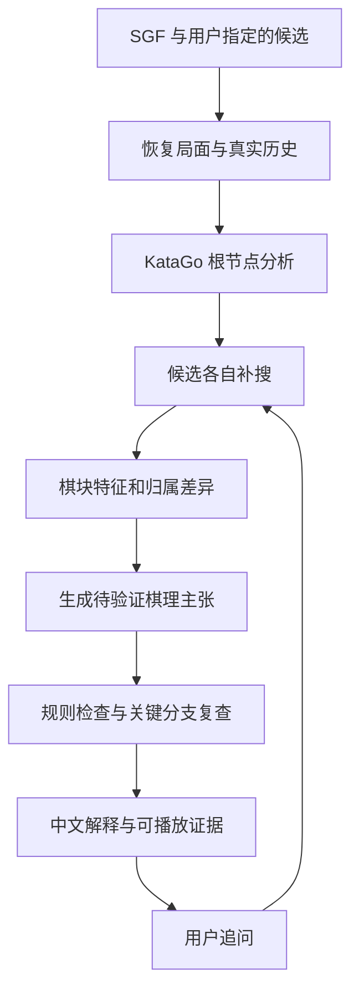

# KataGo Explainer：项目实施方案

[English](PROJECT_PLAN.md) | 简体中文 | [接口验证 / Verification](feasibility.md)

版本：2026-10-03。面向围棋与开发处于入门阶段的个人开发者，目标是完成可运行、可演示、可评测的围棋解释项目。

这份文档是实施方案，文中的开发周期、数据量、搜索预算和验收数值均为建议起点，不是已实现功能或已测得效果。实际接口测试结果单独记录在同目录 feasibility.md 中。

## 1. 项目定位与目标

项目名称：**KataGo Explainer**。核心方向是基于反事实搜索与证据约束，解释围棋候选着法的取舍。

项目将 KataGo 的搜索证据、棋盘事实和语言模型生成结合起来；技术说明和评测结果按照常规软件项目组织。

目标用户是已经知道围棋基本规则、希望复盘自己的初中级棋友。第一版完成以下流程：

> 上传 SGF 棋谱 → 选择某一手 → 查看 KataGo 推荐与实战手的差别 → 播放候选变化 → 读中文解释 → 指定另一手继续比较 → 导出复盘报告。

核心问题是：“在相同局面、规则和计算预算下，推荐手 A 与实战手或另一候选 B 有什么区别？哪条对手应对揭示了区别？棋盘上的哪些事实支持这个讲解？”

研究目标分成两部分：降低无证据棋理主张；提高用户理解和迁移应用棋理的能力。能否完成这两个目标，需要实验检验。

项目优先复用 KataGo 的现成引擎和模型。主要工作放在搜索调度、候选比较、棋盘特征、主张验证和交互展示上。

## 2. 先把“为什么是一选”说准确

### 2.1 引擎排序与胜率最大值

从 `moveInfos` 中取 `order == 0` 来标识该次分析的一选。不能自己按 `winrate` 重新排序再叫“一选”。KataGo 的选着涉及搜索、效用和选择机制；其公开文档提供 `playSelectionValue`，描述它与胜率、目数及其他因素有关。只有很少访问的候选，即使暂时显示更高胜率，也不意味着更值得推荐。[KataGo v1.18.1 接口文档](https://github.com/lightvector/KataGo/blob/v1.18.1/docs/Analysis_Engine.md)

产品应该区分三个问题：

| 用户问题 | 系统应给出的答案 |
| --- | --- |
| 为什么 AI 排它第一？ | 展示这次分析的 order、访问量和配置，并说明候选排序是否稳定 |
| 为什么它比我下的好？ | 在同一执棋方视角下，比较候选独立分析的胜率、目差与对手应对 |
| 这手棋有什么棋理？ | 用棋块、气数、合法变化和预测差异支持具体主张 |

### 2.2 “好棋让胜率上涨”不是稳定的定义

当前局面的估值已经包含了对未来好棋的预期。走一手好棋之后，胜率可能基本不变。前后两次估值的变化还可能来自搜索预算、根节点聚合和估计噪声。

因此，着法质量的主要比较对象应是**同一局面可选的其他着法**。整盘前后胜率曲线可以展示，但须与“这手相对推荐手损失多少”分开。

在大优或大劣局面，胜率可能接近饱和。页面同时显示胜率和 `scoreLead`，例如“相差 0.2 个百分点，但目差估计相差 3 目”。胜率是引擎在相应模型与分析设置下的估计，不能直接当作该用户实战获胜概率。

### 2.3 对解释能力的准确承诺

系统交付的是“有棋盘和搜索证据支撑的事后解释”。它并未恢复神经网络内部完整决策过程，也没有对所有可能变化作数学证明。

合理表述是：“在当前搜索中，A 避免了变化 V 中的断点问题，候选比较支持它优于 B。”对于复杂死活，使用“在这条变化中”“当前搜索预计”等有明确条件的语句。

## 3. 第一版范围与最终交付

### 3.1 必做范围

| 能力 | 第一版具体范围 | 验收方式 |
| --- | --- | --- |
| 棋谱导入 | 单个 SGF，主线浏览，9/13/19 路，保留规则、贴目、让子和真实历史 | 与已知棋谱逐手核对 |
| 基础分析 | 查询指定局面，显示前三候选、胜率、目差、访问量 | 数字对应原始 JSON |
| 候选比较 | 一选、实战手、另一候选；用户可输入合法坐标 | 各候选独立补搜，记录预算 |
| 棋盘展示 | 棋子、坐标、候选点、变化播放、归属预测差分 | 能从文字点击到对应变化 |
| 初级讲解 | 吃子、连接、断点、防守四类优先；其他局面显示有限说明 | 逐条主张可复查 |
| 主张验证 | 坐标、执棋方、气数、提子、变化合法性、数字和证据引用 | 自动检查加人工评审 |
| 追问 | “为什么不下这里？”“对手脱先怎样？”“哪块棋受影响？” | 调用分析工具获得新证据 |
| 中英双语 | 文档有中文与英文版本；后续界面标签和讲解支持 zh-CN/en 切换 | 两种语言引用同一证据与数值，术语含义一致 |
| 导出 | Markdown/HTML 报告和分析 JSON；保留证据与环境信息 | 在另一台机器可阅读，分析可复现 |

用户所选局面位于第 t 手之前时，实战手取 SGF 中随后实际走出的那一手；页面明确是“落子前分析”还是“落子后局面”，避免错位。

### 3.2 后续扩展

完整死活读取、复杂劫争、征子专题、人类棋力个性化、整盘自动讲解、在线对弈集成、账号与云部署，放在核心实验完成之后。项目交付可采用本地网页应用，演示时不依赖外网的分析结果与报告应能直接播放。

征子看似容易，实际受全局引征影响；“两眼”“净死”“绝对先手”等强主张需要独立验证能力，不能靠图形标签或一句提示词获得可靠性。

### 3.3 最终成果包

1. 能运行的本地复盘应用，附安装和启动说明。
2. 结构清晰的源代码仓库，固定依赖与配置。
3. 小规模标注局面集，附拆分、标签说明与评审记录。
4. 原始分析结果、解释证据包、基线和消融实验输出。
5. 实验报告，包含失败案例、耗时和限制。
6. 技术报告、演示演示文稿及 3–5 分钟演示录像。

## 4. 系统结构：先完成一个可控的 Agent

推荐采用明确步骤的工具调用流程。围棋计算与事实检查由程序负责；语言模型负责将已确认的证据组织成中文，并提出有预算限制的补充查询。



第一版的工具可设计为：

| 工具 | 输入 | 输出 | 责任 |
| --- | --- | --- | --- |
| `analyze_position` | 真实历史、规则、贴目、预算 | 原始候选和局面评估 | 判断当前推荐 |
| `compare_moves` | 同一局面和 2–3 个候选 | 独立估值、变化、归属差分 | 找出取舍 |
| `inspect_groups` | 棋盘与合法落子 | 棋块、气数、直接连接、提子 | 提供可精确核对的事实 |
| `analyze_branch` | 候选后的合法变化前缀 | 关键节点的替代应手与估值 | 检查关键反击 |
| `validate_claims` | 结构化主张和证据包 | 支持、反驳、证据不足 | 控制解释质量 |

这些是拟实现的接口，并不表示它们目前已经写好。先用普通 Python 函数完成；需要更复杂的流程时再引入 Agent 框架。

一次解释限制候选数量、搜索预算、补搜轮数、最长等待和文字长度。例如：最多 3 个候选、2 轮补搜、最多 2 条额外反击。超出预算就给出已有证据与尚未解决的问题，避免无限分析。

## 5. 核心算法：候选反事实比较

### 5.1 准备同一局面

记录棋盘大小、真实落子历史、初始棋子、轮到谁、规则、贴目、引擎版本、模型与搜索设置。模型或规则变化后不能直接复用旧解释。

读取 SGF 时处理 `SZ/KM/RU/AB/AW/PL/HA`，支持停一手，并明确对分支和途中摆子节点的处理范围。无法可靠映射的规则要提示用户确认分析条件，并在输出记录采用了什么规则。不能静默把所有棋谱都按默认 7.5 目分析。

先取小样本验证坐标：GTP 列号跳过 I；SGF 原点与界面原点需转换；ownership 从左上按行排列。坐标错误会使整个解释体系失效。

### 5.2 发现候选与稳定性

先做未限制的根节点搜索，得到 `order=0` 的 A、次选 B 和实战手 C，去掉重复。实战手如果没被搜索到，也须补查，而不是当作没有胜率。

建议先试 256/1024 visits 做开发冒烟和候选发现，再以 2048 visits 作为初始比较预算；困难局面尝试 8192 visits。这些数值需要按实测速度和排名变化校准，不应提前承诺解释延迟。

重要局面在较高预算下重新做未限制根搜索。若一选改变，更新解释对象并记录“更深入分析后推荐发生变化”。候选独立补搜后出现数值取舍，也应如实呈现。

### 5.3 给候选相近的独立预算

对 A/B/C 分别做一次请求，保留同一历史，仅约束第一手。例如当前黑棋走、要评估 Q5：

```json
{
  "allowMoves": [
    {"player": "B", "moves": ["Q5"], "untilDepth": 1}
  ]
}
```

`untilDepth=1` 仅约束根部；后续允许对手自由应对。保持同样的 `maxVisits` 与其他设置，并保存实际返回的候选访问量与耗时。相同 visits 是控制实验条件的一种办法，不代表完全相同的计算工作量。[官方 allowMoves 定义](https://github.com/lightvector/KataGo/blob/v1.18.1/docs/Analysis_Engine.md)

注意：在这种受限请求中，每个单独候选都可能变成 `order=0`。**它不代表原局面的一选**；原局面推荐来自未限制的根搜索。

也可以追加候选到真实历史，然后分析下一局面。这时轮到对手，指标转换和比较方法必须保持一致。第一版固定使用一种方法，以免把子局面根部统计和候选统计混在同一表中。

### 5.4 统一指标视角

建议配置固定 `reportAnalysisWinratesAs=BLACK`，存储黑方数值。显示原执棋方时：

```text
原执棋方是黑：p = p_black，lead = lead_black
原执棋方是白：p = 1 - p_black，lead = -lead_black

候选胜率损失（百分点）= 100 × (p_A - p_C)
候选目差损失（目）= lead_A - lead_C
```

同一对比较中的 A/C 均使用原执棋方视角。A 是明确保存的参考推荐手；如果差值是负数，如实展示该单一指标上的取舍。因为一选采用综合选择机制，负差值可能来自选择目标差异，也可能来自搜索波动，不能直接判作错误或悄悄截断。结合综合目标与稳定性决定是否补查。支持无胜负规则时还需单独保存 no-result 概率，明确上述胜率展示的约定。

独立评估表和原根搜索排序表分开存储。`rootInfo` 是根部综合统计，与最优候选值定义不同；禁止用二者相减当成精确着法损失。

### 5.5 提取影响区域和棋盘事实

对 A/B 的候选 ownership 作差分，寻找空间连续、变化明显的区域，标出相关棋块。固定 BLACK 时正值偏黑、负值偏白；展示白方受益时相应转换方向。

区域差分用于定位“哪里值得解释”，不能直接累加成“这块贡献 4.8 目”，也不能将 `scoreLead` 拆成几个看似精确的区域因果贡献。

事实提取优先做：直接同色连接、棋块大小、气数变化、打吃、立即提子，以及某条合法变化中的提子事件。虚连接、安定程度、攻击方向、先手和死活属于更强的语义，需要更多搜索或人工验证。

棋块通过原有棋子集合追踪，处理连接、分裂与被提；不要用每一步临时棋块编号直接比较“同一块棋”。

### 5.6 找出关键反击

从候选 B 的主变化中找关键点：断、打吃、提子或明显归属转折。在这些节点重新查询对手可选应手，验证解释是否依赖对手配合。

若用户问“对手脱先如何”，应至少比较一个真实的全局候选和局部回应，保持完整棋盘。测试一手随意远处棋或 pass，只能回答这一手脱先的结果，不能证明“所有脱先都会失败”。

PV 是搜索提供的代表变化。只有 PV 坐标而没有各节点完整评估时，需要重新分析关键节点；尾部访问少的着法不宜当作已证实结论。

### 5.7 判断可以讲到什么程度

| 证据情况 | 允许表达 |
| --- | --- |
| 规则程序确认直接连接 | “这一手把两块黑棋直接连起来” |
| 合法变化中发生提子 | “这条变化走到第 6 手，白方这三子被提掉” |
| 多次搜索均显示更好 | “在这些预算下，A 的估计优势较稳定” |
| 仅有 ownership 转好 | “预测显示右边归属更偏向黑方” |
| 两候选接近且排序变化 | “当前偏好 A，B 也接近，证据不足以说 A 唯一” |
| 复杂死活没有充分覆盖 | “这条变化对黑有利，但尚未确认所有抵抗” |

“接近”的提示门槛可以从 0.3–0.5 目起试，并结合胜率、局面阶段和实测波动校准。它是显示策略，不是证明两手等价的定理。

## 6. 解释数据结构与主张验证

将证据包与文本分开保存。文本可以重写，事实来源不随重写改变。

文档、探针帮助与报告使用中英双语。后续界面和解释增加 `language=zh-CN/en`，两种语言共用同一证据包，坐标、数字、变化和证据级别保持一致；围棋术语以双语术语表统一。当前仅实现文档与探针的双语说明，应用界面仍在开发计划中。

以下是拟用数据结构，数值和坐标为格式示意，并非实际棋局结论：

```json
{
  "position_id": "game01_turn87",
  "actor": "B",
  "recommendation_source": "unrestricted_root_query",
  "best_move": "Q5",
  "comparison_move": "R6",
  "claims": [
    {
      "id": "c1",
      "text": "在变化 V1 中，Q5 保持了两块黑棋的直接连接。",
      "type": "connection_in_variation",
      "evidence_ids": ["board_v1_step3", "group_check_01"],
      "variation_id": "V1",
      "verification": "rule_verified",
      "scope": "仅限所展示变化"
    }
  ],
  "uncertainties": ["更深搜索仍可能改变候选排序"]
}
```

主张验证分成三个层次：

1. **规则可验证事实**：合法坐标、棋子颜色、轮次、实际连接、气数、提子、数字和棋盘重放。尽量由确定性程序判定。
2. **搜索支持的判断**：候选优势、具体反击、预测归属变化。附请求、预算和变化，标明搜索条件。
3. **需要专家或更强工具的棋理**：复杂死活、绝对先手、全局厚薄、长期战略原因。证据不足时降低表述强度或不输出该主张。

每条主张返回 `supported / contradicted / insufficient_evidence`，并记录原因。语言模型自评或第二个语言模型赞同，可以用来发现问题，但不能代替棋盘验证。

`scoreStdev` 描述预测终局分数分布的离散程度，不能当成候选估值的标准误，也不能直接生成“优势 2 目 ± 1 目”的置信区间。`ownershipStdev` 同样不是棋理解释的可信度。第一版用重复搜索与预算变化描述稳定性，暂不输出未经校准的百分比置信度。

生成流程先固定数字，再列证据，再写文本。若验证失败，只允许有限次修改，最终仍不通过就输出事实、变化和“暂无可靠棋理说明”。评测必须报告这种保留结论的比例。

## 7. 用户看到的解释形式

每次解释保持同样的信息次序：当前主要问题 → 推荐手作用 → 另一手的关键反击 → 胜率/目差取舍 → 可复用棋理 → 证据与局限。

例如，一次真实的讲解如果得到足够验证，最终可以按以下形式组织；这里仅示意结构：

> 当前要优先处理右边黑棋的断点。推荐 A 的作用是补连接，使后续战斗有支撑。若走 B，白棋在变化 V2 中从断点切入，黑方需要多花一手处理。点击 V1/V2 可以比较两条线路。候选表列出同预算下的胜率和目差；这次分析支持 A 更稳健，但未覆盖所有复杂后续。

讲解中的棋理必须来自该局面的证据，不能将这一段套在任何棋局上。每句话可点到相关区域，变化播放显示双方颜色和第几手。归属热图可开关，文字不能只写“看热图就知道”。

第一版用滑块选择手数、表格选择候选、坐标输入追问即可。逐步增加直接点击棋盘的交互，避免最早就被网页交互细节拖住。

## 8. 技术选型：适合初级开发者的顺序

| 部分 | 第一阶段 | 何时升级 |
| --- | --- | --- |
| 主语言 | Python | 核心原型始终保留 Python |
| 界面 | Streamlit，加 SVG/简单棋盘绘制 | 核心解释和实验完成后再考虑 React |
| SGF | sgfmill 解析、基础棋盘重建 | 劫/超级劫等合法性以 KataGo 接口或专门历史检查为准 |
| 引擎 | KataGo Analysis Engine 子进程 | 需要更丰富搜索子树时再改 C++ |
| 存储 | 原始 JSONL + SQLite 元数据 | 多用户服务时再考虑服务器数据库 |
| 讲解 | 先固定模板，再接支持结构化输出的语言模型接口 | 有评测证据后再讨论微调 |
| 流程 | 明确 Python 状态和预算 | 工具分支复杂到有维护必要时再用 Agent 框架 |
| 导出 | Markdown 与 HTML | PDF 是排版扩展，不影响核心研究 |

选择 Streamlit 的理由是可以用 Python 快速做交互数据页面，减少同时学习前端和后端的负担；sgfmill 有 SGF 树和棋盘相关接口。两者的具体依赖版本在开发时固定。[Streamlit 官方文档](https://docs.streamlit.io/)，[sgfmill 官方文档](https://mjw.woodcraft.me.uk/sgfmill/doc/1.1.1/)

目录建议：

```text
go-explainer/
  app.py                    页面入口
  engine/client.py          JSON 行协议和请求调度
  engine/perspective.py     统一指标视角
  board/sgf_loader.py        棋谱与真实历史
  board/features.py          棋块与气数等事实
  analysis/compare.py        候选独立补搜
  analysis/branches.py       关键反击复查
  explanation/schema.py     主张与证据结构
  explanation/generator.py  模板和语言模型
  explanation/verifier.py   规则与证据检查
  evaluation/               数据集、基线、评审与统计
  data/                     棋谱、标注和原始输出
  reports/                  可阅读报告与失败案例
  configs/                  引擎和实验配置
```

接口客户端必须处理 JSON 单行协议、异步乱序、stderr、进程退出、超时、取消和部分响应。按 `(id, turnNumber)` 对应结果；`isDuringSearch=true` 不能当最终结果。基础示例可参考当前源码的 `python/query_analysis_engine_example.py`，然后补齐这些工程条件。

## 9. 你现有电脑上的起点

本次只读检查确认：

- 源码在 `<LOCAL_WORKSPACE>\KataGo-master`。
- KaTrain 已带 KataGo v1.18.1 OpenCL 和 `b10c384h6nbttflrs.bin.gz` 模型。
- 显卡有 RTX 5070 Laptop GPU，约 8 GB 显存；内存约 32 GB。
- 有对应 OpenCL 调优缓存。
- 有 Python 3.12.14 运行时；当前 PATH 的 python 是 WindowsApps 别名，启动脚本应指定实际 Python 或建立项目虚拟环境。

当前配置 `reportAnalysisWinratesAs=BLACK`、默认 `maxVisits=500`，原配置面向较多并行任务。项目应使用自己的配置，按单局面交互与批量实验分别测量线程和批量设置，保留 KaTrain 原配置。

已有模型适合验证数据链路和最小系统；正式实验是否需要更强参考模型，取决于试标结果、评审伙伴要求和实测成本。引擎深搜可作为相对参考，不能当作所有棋理的绝对真值。

本仓库的接口探针本次已成功：一条 19 路开局的根搜索加两个候选独立补搜，总耗时约 8.344 秒，实际取得候选排序、胜率、目差、PV、逐手访问量与 361 点 ownership。原一选 O3 和次选 R6 补搜后的黑方目差估计分别为 -0.7778/-0.8814 目，相差约 0.1035 目。这是一条低预算样例，证明接口可用；正式解释质量和产品性能仍需按后续方案测评。完整请求、原始输出和限制见 feasibility.md。

## 10. 数据集：先精后扩

### 10.1 第一个月先做 30 个试标局面

建议从自己的对局、可使用的公开棋谱和自行构造的练习局面中选取；记录来源与使用条件。包含吃子、连接、断点、防守，以及少量两手接近、复杂劫或搜索不稳的反例。

每个局面由程序保存完整历史和分析证据。人工标注重点不是写唯一标准作文，而是圈出：关键棋块、允许主张、关键反击、不应出现的强断言和是否存在近似等价候选。

尽早请一位较强棋友或围棋老师看试标集。如果暂时找不到，先收缩到程序能精确验证的棋盘事实，把专家棋理评测列为待完成，不能用自我评审代替。

### 10.2 正式实验建议规模

一个可管理的方案是 150 个局面：50 个开发/校准，100 个固定测试；条件允许扩至 200。核心四类占多数，同时保留复杂死活、劫、大优大劣、近似等价和排名不稳的挑战样例。

按整盘棋拆分，避免同一棋谱的邻近局面同时进入开发与测试。对旋转、镜像和相似局面分组；模型训练或提示调整只看开发集。开发期间反复观察测试集会使其失去盲测意义。

每条数据至少有：

| 字段 | 内容 |
| --- | --- |
| 局面信息 | game_id、turn、SGF/history、规则、贴目、执棋方 |
| 分析条件 | 引擎版本、模型标识/校验值、配置、预算 |
| 标签 | 局面类别、难度、关键棋块、关键反击 |
| 解释约束 | 允许与禁止主张、近似等价标记、证据不足项 |
| 人工评审 | 评审者、评分、严重错误、分歧处理 |

可以两位评审独立审部分样例，报告一致性与分歧。专家无法统一的棋理应保留多种可接受解释，不能硬制造唯一真值。

## 11. 实验：证明解释方法是否有用

### 11.1 研究问题

- RQ1：候选反事实搜索是否减少无依据棋理主张？
- RQ2：主张验证是否减少事实错误和过强结论？
- RQ3：与数字/变化图或固定模板相比，用户是否更能理解并在相似局面应用？
- RQ4：效果改善增加了多少搜索时间、语言模型调用和等待时间？

技术报告可以重点完成 RQ1/RQ2/RQ4，用户实验作为条件允许的扩展。系统复杂度应服务这些问题。

### 11.2 基线与消融

| 方法 | 内容 | 用途 |
| --- | --- | --- |
| B0 | 数字、PV 和固定事实模板 | 检查自然语言复杂流程是否带来价值 |
| B1 | 直接将普通根分析 JSON 给同一语言模型 | 比较最容易实现的讲解方式 |
| B2 | 候选独立补搜 + 特征 + 关键反击证据 + 语言模型，关闭主张验证 | 与 Full 使用完全相同的冻结证据包 |
| Full | 同一证据包 + 语言生成 + 主张验证与有限重写 | 单独测试验证流程贡献 |

RQ2 必须固定 B2/Full 的候选与分支证据、引擎预算和初始生成设置，仅改变验证和有限重写；不让 Full 在这个消融中额外取得棋局证据，同时报告新增语言模型调用成本。在线演示的自适应补搜可另做整条管线评测。

RQ1 比较搜索调度时，用相同总搜索预算的普通根搜索与候选补搜，保持特征提取和语言生成设置一致；分别报告实际访问量和用时。预算不匹配的实验只能说明整条管线在不同成本下的效果。若时间允许，再移除 ownership，或关闭关键反击复查；每次只改变一个因素。

所有方法使用相同的测试局面、模型、规则和语言模型版本；控制讲解字数、采样设置和评审展示格式。评审时隐藏方法名字、随机打乱顺序，防止更长或更漂亮的答案获得偏好。

记录随机种子、线程与实际 visits。多线程搜索和语言生成可能存在运行波动，重要比较可重复运行并报告分布，不能把一次运行当作稳定的精确值。

### 11.3 核心指标

| 指标 | 如何计算 |
| --- | --- |
| 数字与棋盘事实正确率 | 正确的数值/棋盘事实 ÷ 被检查事实数 |
| 主张证据支持率 | 专家认为证据充分的主张 ÷ 输出的可评审主张 |
| 严重错误率 | 含非法变化、虚构提子、颠倒执棋方、错误强死活断言的解释比例 |
| 关键反击覆盖率 | 包含标注关键反击的适用解释比例 |
| 不确定性处理 | 有标注争议时是否保留结论；正常样例是否过度保留 |
| 覆盖率 | 系统愿意给出实质解释的局面比例，与错误率一起报告 |
| 用户可理解性 | 盲评 1–5 分，附明确评分标准 |
| 效率 | 冷/热启动、p50/p95 延迟、实际 visits、工具调用和模型 token 成本 |

自动校验“证据引用存在”不等于“证据足以支持语义”，后者仍需专家评审。提高支持率时不能通过全部拒答实现，因此必须同时报告覆盖率。

数字、颜色和坐标正确率应作为工程硬约束。人工主张支持率可以先设 90% 为试验目标；具体阈值与评审伙伴基于试标集确定。未达目标也是研究结果，应分析错误类型，不能只展示成功案例。

### 11.4 用户教学试验

条件允许时招募 12–20 名目标棋力用户。交叉体验“数字/变化或模板版”和完整系统，平衡顺序与题目难度。先看解释，再在未见过的相似局面选点并说明理由；可以增加一次延后测验。

记录迁移题正确率、抓住关键取舍的比例、耗时和错误自信。只问“看懂了吗”不足以验证学习效果。小样本按探索性结果汇报，使用合适的配对统计或区间描述，不能未经分析宣称显著提高棋力。

评分量表与评价流程先在开发样本上固定，然后运行测试；以局面或整盘棋为单位汇总，避免将同一解释的多条主张视作完全独立样本。

## 12. 工程验证与性能预算

有必要的检查集中在容易导致误导的地方：

- 黑白视角转换与候选损失符号。
- SGF/GTP/热图坐标的一致性。
- 提子、停一手、让子、基本劫与历史保留。
- 单候选受限分析的 `order=0` 不被误标为原局面一选。
- 异步多个请求、多个 turn、部分输出、warning 与错误、进程退出。
- 每条展示变化可重放，真实提子与文字一致。
- 缓存更换模型/规则/预算后正确失效。

缓存键包含真实历史、规则、贴目、执棋方、模型、引擎版本和影响分析的设置；`thisHash/symHash` 单独不足以代表所有条件。技术报告实验固定缓存策略，分别报告首次分析和命中缓存的时间。

资源估算先实测一个完整解释的搜索成本。设根发现预算为 N0，候选数 k、每候选预算 Nc，额外分支数 j、每分支预算 Nb，总请求预算近似 `N0 + k*Nc + j*Nb`，再加排名复查请求。visits 不等于用时；使用实际 wall time 和设备工作时间估算数据集成本。

不要从一条简单开局探针推断复杂中盘延迟。正式测量至少选 10–30 个不同阶段局面，同时记录引擎初始化、纯搜索和语言生成时间。

首次界面可设“快速分析”和“深入比较”两档；深度模式按需开启候选 ownership，减少整盘扫描的输出和内存开销。

## 13. 12 周实施路线

假设每周投入约 15–20 小时，有评审伙伴或较强棋友提供阶段反馈。初级开发者或遇到数据标注困难时，合理顺延到 16 周；周期是工作计划而非保证。

| 周 | 任务 | 当周必须留下的成果 | 验收 |
| --- | --- | --- | --- |
| 1 | 学 Python 必要基础、JSON、子进程；跑通引擎 | 指定局面原始 JSON 和说明 | 不依赖 KaTrain 界面拿到结果 |
| 2 | SGF 主线解析、棋盘恢复、坐标与视角 | 能浏览 3 个已知棋谱 | 手数、提子、执棋方一致 |
| 3 | Streamlit 棋盘、候选表、PV 播放 | 可操作的分析页面 | 选一步查看候选和变化 |
| 4 | A/B/C 独立补搜、缓存、比较表 | “为什么不下 B”比较功能 | 对手未被强制配合，预算可追踪 |
| 5 | 棋块、气数、连接、提子事实 | 四类事实提取与模板讲解 | 自动事实核对正确 |
| 6 | 证据包与结构化中文生成 | 30 个试标局面的讲解 | 能从文字定位证据，评审伙伴试用 |
| 7 | 主张验证、关键反击复查、近似等价 | 验证日志和失败案例 | 证据不足时保留结论 |
| 8 | 固定数据集、标签与基线 | 评测数据和实验脚本 | 按整盘拆分，评分标准固定 |
| 9 | 冻结版本，运行完整系统与消融实验 | 可复现结果表与原始输出 | 版本、证据、配置与结果共同归档 |
| 10 | 用户试验或扩大专家评审 | 用户/专家记录与错误分析 | 不仅收集满意度 |
| 11 | 工程修复、完成报告导出 | 稳定应用、README、录像 | 后续修复与技术报告冻结版本分开记录 |
| 12 | 写技术报告、准备演示、归档 | 技术报告、成果包和复现实验说明 | 成功和失败案例均可解释 |

第 4 周检查：如果候选比较仍未跑通，优先解决接口与视角，不继续增加功能。第 6 周检查：如果多数棋理不能验证，收缩类别或先回到事实模板。第 8 周之后控制功能扩张，保障实验和技术报告时间。

第 9 周测试后的修改不能继续声称在原测试集上盲测。技术报告保留冻结版本及原始结果；展示版后续修复作为工程迭代说明。若需要评价修复后的最终方法，应另留一组此前未查看的局面。

如果最后时间不足，保留“SGF 浏览 + 两候选比较 + 四类事实 + 固定模板/语言模型基线 + 小规模专家评审”，减少云部署、复杂追问和个性化。这样仍有完整的可演示系统与研究结论。

## 14. 研究贡献、相关工作与技术报告组织

可以提出并验证的贡献是：

1. 一个把候选补搜、棋盘事实和语言主张绑定起来的解释流程。
2. 面向围棋解释的支持/反驳/证据不足验证机制。
3. 一个小而清晰的局面评测集及方法比较。
4. 系统在解释准确性、反击覆盖和成本方面的实证分析。

贡献是否成立取决于相关工作比较和实验，不能仅因使用 Agent、LLM 或多角色就称为算法创新。

已有项目可作参考：

- [KaTrain](https://github.com/sanderland/katrain)：参考棋谱复盘、候选变化与教学交互。
- [Kifu-Sensei](https://github.com/YianXie/Kifu-Sensei)：作者公开实现围棋自然语言讲解的应用流程，可研究其证据如何进入生成。
- [Clarus](https://github.com/fengxuebailu/clarus)：作者公开采用候选对比和解释预测验证，适合讨论不同验证方式的适用边界。

这些仓库的说明与演示只能作为方法和工程参考，不能直接当成其效果已经独立验证的证据。“另一个模型根据说明猜中着点”可说明文字具有可用性，但仍可能依赖坐标线索或表面模式，不能单独证明棋理忠实。

技术报告建议围绕以下逻辑组织：问题与相关工作；KataGo 接口和指标语义；反事实与证据约束方法；系统实现；数据集与实验；失败案例和局限。将“为什么复杂系统值得增加”写成待检验问题，若模板效果接近完整系统，也应如实讨论。

## 15. 第一周具体任务

1. 保留已有 KaTrain 环境，在独立项目目录建立虚拟环境和自己的配置。
2. 从一条合法局面请求拿到一选、次选、胜率、目差、visits、PV 和候选 ownership。
3. 确认一选来自 `order=0`，用一条白方行棋样例验证视角转换。
4. 给两个候选分别做根部受限分析，将对手后续保持自由。
5. 把原始请求、结果和比较表保存到文件，并手动播放一个变化核对。
6. 写一段仅包含真实数字和规则事实的模板说明，标明尚无棋理验证。
7. 与评审伙伴确认题目、数据集规模、专家评审渠道和项目验收要求。

第一周的成功标准很具体：**输入一个局面和两个候选，输出有原始证据的比较结果，且黑白视角正确**。这条链路完成后，后续每个模块都有可以接入和验收的位置。

## 16. 容易影响项目结果的限制

| 风险 | 实际影响 | 处理办法 |
| --- | --- | --- |
| 开发与围棋知识都在入门阶段 | 复杂功能和棋理标注容易同时拖慢 | 先四类可验证事实，分阶段交付 |
| 原模型或搜索不够深 | 参考推荐和解释可能变化 | 预算递增复查，保留版本与不确定性 |
| 解释流畅却缺乏依据 | 用户误学错误棋理 | 主张拆分、规则检查、专家盲评 |
| 把热图解释成死活证明 | 过强结论 | 仅作线索，死活需要额外验证 |
| 两手实际上接近 | 为一选硬编独特理由 | 显示接近候选集合和排名波动 |
| API 网络或费用限制 | 演示无法实时生成 | 模板后备、缓存真实证据与预生成报告 |
| 找不到强棋力评审 | 语义正确性结论薄弱 | 早期联系评审伙伴/棋友，收缩语义承诺 |

明确区分三个状态：接口能运行；应用功能完成；解释方法经实验支持。项目应分别提供对应证据。


发布说明：以上本机绝对路径已替换为环境占位符；真实分析数值和测试条件保留。
